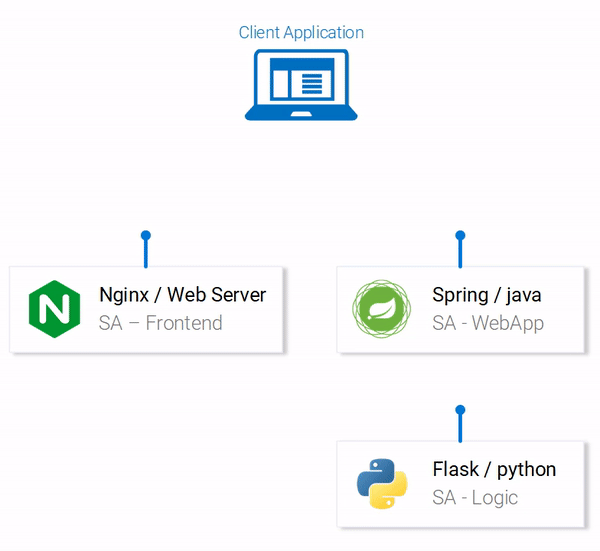
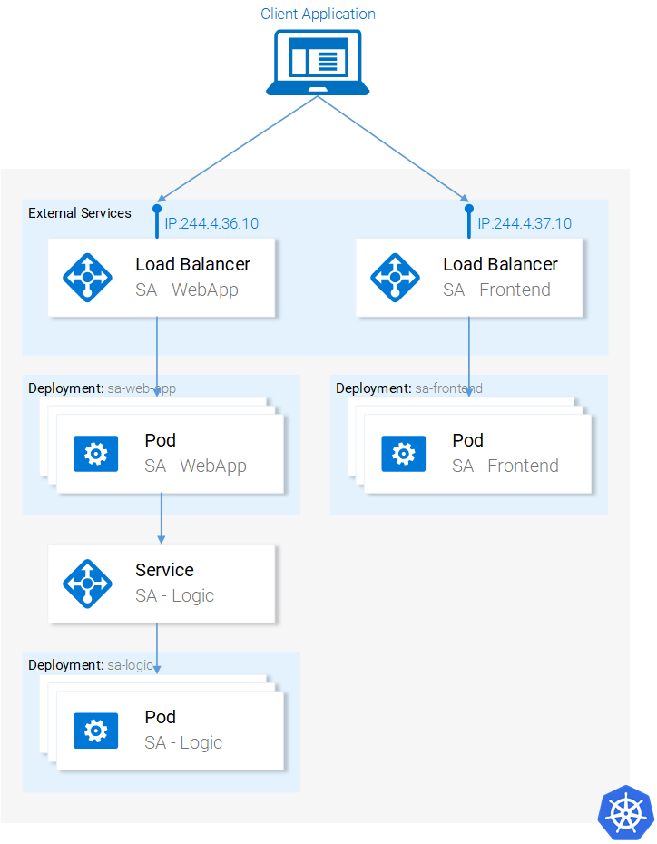

# Kubernetes, Guide to Orchestrating Containers






Please find the README in every folders.

# Kubernetes deployement 
``` sh
kubectl create -f sa-frontend-pod.yaml
kubectl get pod -l app=sa-frontend --watch
kubectl port-forward sa-frontend 88:80 # Quick debugging

# Load Balencer
kubectl create -f service-sa-frontend-lb.yaml
kubectl get svc
# Commande to launch with k3s??

# Deployment 
kubectl apply -f sa-frontend-deployment.yaml
kubectl get pods

# Rolling update
kubectl apply -f sa-frontend-deployment-green.yaml --record

# Rolling back 
kubectl rollout history deployment sa-frontend
kubectl rollout undo deployment sa-frontend --to-revision=1


# Deploy Service Python
kubectl apply -f sa-logic-deployment.yaml --record

```


To learn more about Kubernetes and other related topics check the following examples with the **Sentiment Analysis** application:

* [Kubernetes Volumes in Practice](https://rinormaloku.com/kubernetes-volumes-in-practice/):
* [Ingress Controller - simplified routing in Kubernetes](https://www.orange-networks.com/blogs/210-ingress-controller-simplified-routing-in-kubernetes)
* [Docker Compose in Practice](https://github.com/rinormaloku/k8s-mastery/tree/docker-compose)
* [Istio around everything else series](https://rinormaloku.com/series/istio-around-everything-else/)
* [Simple CI/CD for Kubernetes with Azure DevOps](https://www.orange-networks.com/blogs/224-azure-devops-ci-cd-pipeline-to-deploy-to-kubernetes)
* Envoy series - to be added!

### Ressources
This repository contains the source files needed to follow the series [Kubernetes and everything else](https://rinormaloku.com/series/kubernetes-and-everything-else/) or summarized as an article in [Learn Kubernetes in Under 3 Hours: A Detailed Guide to Orchestrating Containers](https://medium.freecodecamp.org/learn-kubernetes-in-under-3-hours-a-detailed-guide-to-orchestrating-containers-114ff420e882)